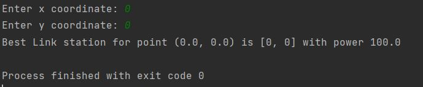
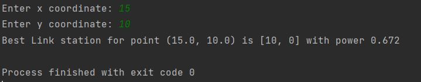
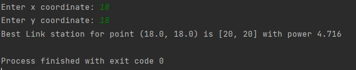

## Problem statement: 

#### Create a function that solves the most suitable (with most power) link station for a device at given point [x,y].


## Just trying some changes


A link station’s power can be calculated:

***`power = (reach - device's distance from linkstation)^2`***

***`if distance > reach, power = 0`***


Function receives list of link stations and the point where the device is located.
Function should output following line:

_“Best link station for point x,y is x,y with power z”_

or:

_“No link station within reach for point x,y”_ 


Link stations are located at points (x, y) and have reach (r) ([x, y, r]) :
```
[[0, 0, 10],
[20, 20, 5],
[10, 0, 12]] 
```


Print out function output from points (x, y):
(0,0), (100, 100), (15,10) and (18, 18) .

## Solution:

Check MaxPower.py 

## Installation:

Clone the repository: `https://github.com/Arpitamona21/most_suitable_linkstation.git`

Install `virtualenv` and enable it.

Install python dependencies on the virtual environment : `pip install -r requirements.txt`

Run python code : `python MaxPower.py`


## Output:

_Function output for points:_ 
`(0,0), (100, 100), (15,10) and (18, 18)`








